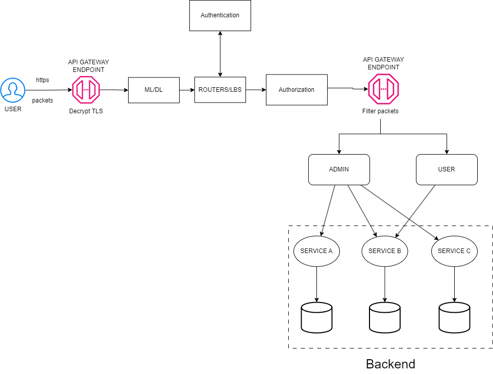

# Detection-and-Mitigation-DDoS-in-Hybrid-Cloud-using-ML-DL
Application Layer in OSI Model

There are three main types of clouds: private cloud, public cloud, and hybrid cloud.

+ private cloud: Controlled and created within a business.

+ public cloud: Controlled by the company providing cloud services, usually a business that sells cloud services.

+ hybrid cloud: A combination of both public and private cloud

### Architecture of project

